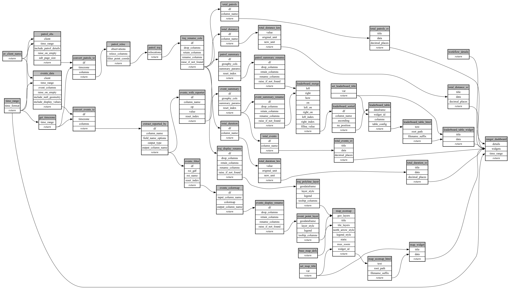

```
# AUTOGENERATED BY ECOSCOPE-WORKFLOWS; see fingerprint in README.md for details

```

```yaml
# fingerprint:
artifacts_sha256_basic: 
  eeba18843e026422186417f40b76fe7e861a2aa2e9d9170f113dbfeb78296e9a
artifacts_sha256_strict: 
  0b8e4dd6f01e9eb4d97bf5ef3a14f7e67cc396bbe11bdec4912623a744017f57
installed_requirements:
- channel: https://repo.prefix.dev/ecoscope-workflows/
  name: ecoscope-platform
  version: {version: ==2.11.15}
- channel: https://repo.prefix.dev/ecoscope-workflows-custom/
  name: ecoscope-workflows-ext-custom
  version: {version: ==0.1.0rc6}
params_sha256: 3a120b2229409d7c8f62b54b232966d27d2a28a33816d81be85e1c0dd7a976b4
spec_sha256: aaff9d84bf32ced10b66194fbc739a400b4fca9068347adbd1f7328fb547b639

```

# ecoscope-workflows-ranger-workflow


